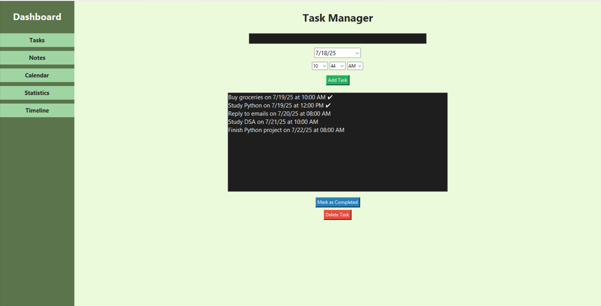
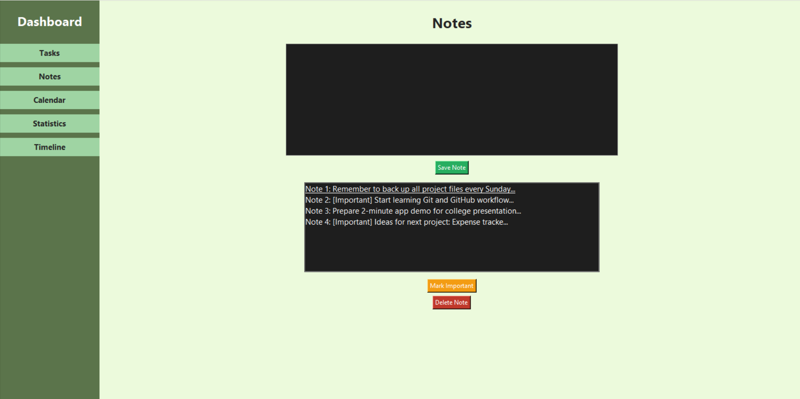
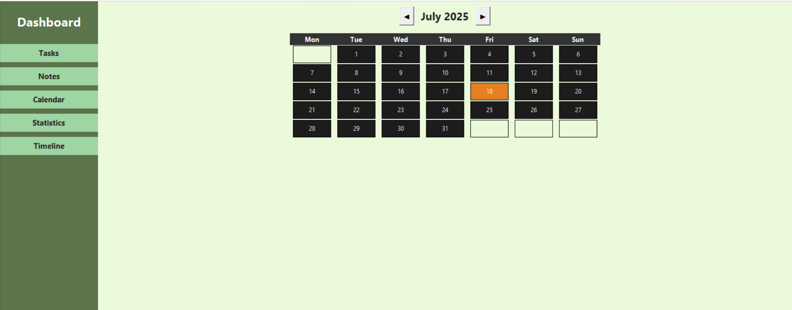
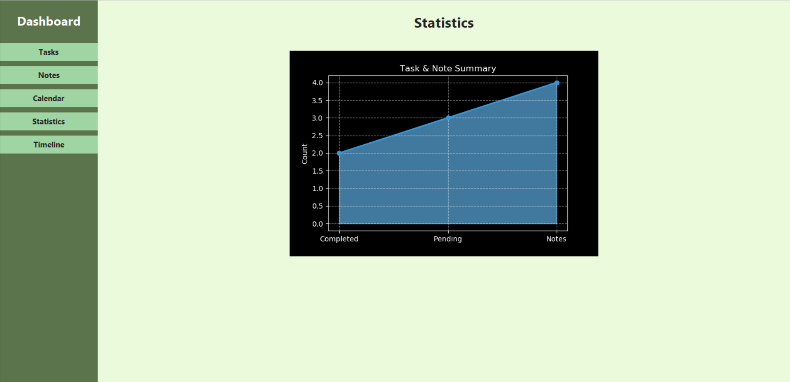
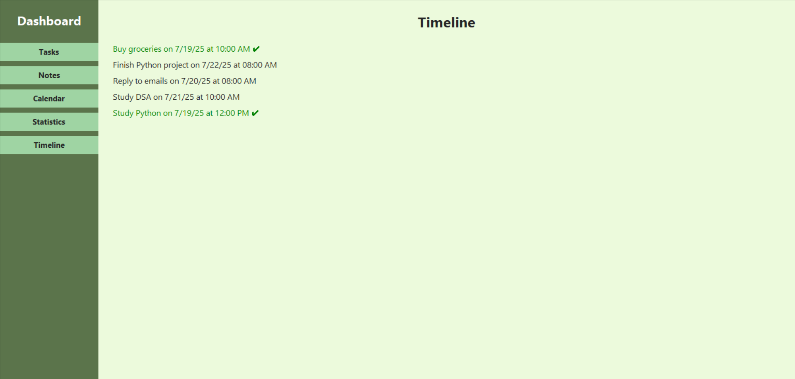

# ToDo list App

This is a simple To-Do List app made using **Python and Tkinter**. It helps you manage your daily tasks, notes, calendar, and track your progress with statistics.

# Features

- Add, complete, and delete tasks
- Set date and time for tasks
- Save and mark notes as important
- View calendar with monthly navigation
- Check task and note statistics in chart form
- View task timeline
- Data saved automatically (JSON files)

# Screenshots
# 1 Task Manager

# 2 Notes Section

# 3 Calendar Section

# 4 Statistics Section

# 5 Timeline Section

